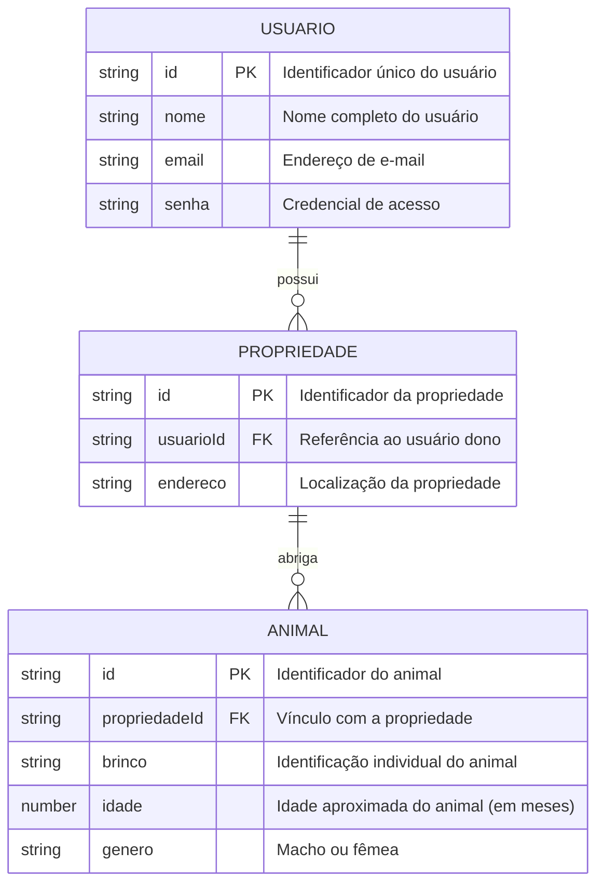

# 🛠️ Especificação Técnica (Tech Spec) - Meu Rancho

Este documento descreve o modelo de dados da aplicação Meu Rancho.

## 1. Modelo de Dados (Diagrama ER)

Abaixo está o Diagrama Entidade-Relacionamento (DER) que representa a estrutura do Meu Rancho.

## 2. Dicionário de Dados

Breve explicação das tabelas principais:

- **Usuário:** Responsável por armazenar os dados de autenticação.
  - id: Identificador único gerado pelo JSON Server (String ou Hash).
  - nome: Nome do usuário, pode tanto ser o nome real quanto um apelido.
  - email: E-mail valido do usuário, usado principalmente para o login.
  - senha: Senha do usuário.
- **Propriedade:** Responsável pela identificação das propriedades e abrigar animais.
- **Animal:** Responsável pela identificação dos animais.
  - brinco: Será usado para a identificação do animal.
  - idade: Uma lista com idades para serem selecionadas. Ex: 0 a 12 meses, 13 a 24 meses, 25 a 36 meses e + 36 meses.
  - gênero: Seleção de gênero do animal.

## 3. Versões das Tecnologias

- **Bootstrap:** v5.3.8
- **GiroRuralAPI:** v1
