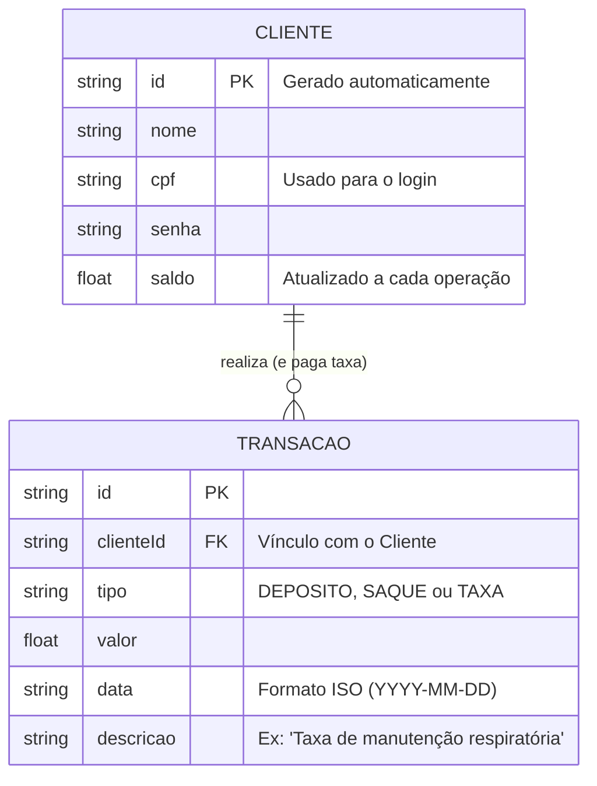

# 🛠️ Especificação Técnica (Tech Spec) - Roubank

Este documento detalha a arquitetura técnica, o modelo de dados e os contratos de API (via JSON Server) necessários para o funcionamento do sistema bancário Roubank.

## 1. Modelo de Dados (Diagrama ER)

Abaixo está o Diagrama Entidade-Relacionamento (DER) que representa a estrutura do nosso "banco de dados" (`db.json`) e como as informações se conectam.



## 2. Dicionário de Dados

Breve explicação das tabelas principais:

- **Clientes:** Responsável por armazenar os dados de autenticação e o saldo consolidado do usuário.
  - id: Identificador único gerado pelo JSON Server (String ou Hash).
  - cpf: Chave de acesso do usuário. Em um cenário real seria único, mas para o MVP não há trava estrita no banco, apenas validação no front-end.
  - saldo: Valor numérico (Float) que representa o dinheiro disponível. Pode ficar negativo devido à cobrança implacável de taxas do banco.
- **Transações:** Registra o histórico financeiro. Regra de Negócio Crítica: Toda transação de SAQUE ou DEPOSITO feita pelo cliente deve gerar, via JavaScript, uma transação secundária automática do tipo TAXA, subtraindo um valor do saldo do cliente.
  - clienteId: Chave estrangeira que vincula a transação ao cliente (padrão de nomenclatura exigido pelo JSON Server para rotas aninhadas).
  - tipo: Aceita apenas os valores "SAQUE", "DEPOSITO" ou "TAXA".
  - valor: Sempre um número positivo. O front-end decide se soma ou subtrai do saldo geral baseado no tipo.

## 3. Rotas da API (JSON Server)

A aplicação consome a API local simulada pelo JSON Server. Abaixo os principais endpoints:

- `GET /usuarios` - Retorna a lista de usuários.
- `POST /usuarios` - Cadastra um novo usuário.
- `GET /transacoes?id_usuario=1` - Retorna o extrato de um usuário específico.

## 4. Estrutura do Banco de Dados (db.json)

Esta é a representação em formato JSON do banco de dados simulado. Esta estrutura serve de contexto para ferramentas de IA e para o JSON Server inicializar a API Fake.

```JSON
{
    "clientes": [
    {
        "id": "1",
        "nome": "João da Silva",
        "cpf": "12345678900",
        "senha": "senha_super_segura",
        "saldo": 850.50
    }],
    "transacoes": [
    {
        "id": "1",
        "clienteId": "1",
        "tipo": "DEPOSITO",
        "valor": 1000.00,
        "data": "2026-03-16",
        "descricao": "Depósito inicial em espécie"
    },
    {
        "id": "2",
        "clienteId": "1",
        "tipo": "TAXA",
        "valor": 50.00,
        "data": "2026-03-16",
        "descricao": "Taxa de boas-vindas do Roubank"
    },
    {
        "id": "3",
        "clienteId": "1",
        "tipo": "SAQUE",
        "valor": 99.50,
        "data": "2026-03-17",
        "descricao": "Saque no caixa eletrônico"
    }]
}
```
